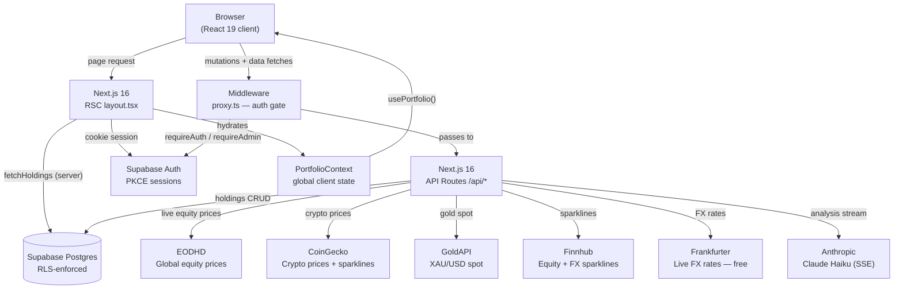

# Summerbuild 2026 — Personal Portfolio Dashboard

A self-hosted finance dashboard for tracking a multi-currency, multi-exchange investment portfolio. Built over summer 2026 as a personal project.

Live prices pull from global exchanges via EODHD (equities), CoinGecko (crypto), and GoldAPI. FX rates come from Frankfurter. Portfolio analysis streams through Claude Haiku. Everything is stored in your own Supabase project — no third-party sync, no shared data.

---

## What it does

**Holdings** — Add stocks, ETFs, REITs, crypto, gold, and property. Each holding records the buy price, date, currency, exchange, units, and broker. Live prices refresh on demand (1-hour cache per holding). The inspector card shows cost basis, current value, asset gain/loss, and FX gain/loss separately.

**Overview** — Hero stats (total value, total gain %, unrealised gain in your base currency). Asset allocation donut, top movers, geographic breakdown, and a summary rail of cost vs. value by asset type.

**FX Lab** — Currency impact analysis. Shows how much of your gain or loss is from asset price movement vs. exchange rate drift. Date-range charts, per-currency dumbbell waterfall.

**Charts** — Portfolio value over time (area chart), asset allocation, sparklines per holding. Preset ranges (1D, 1W, 1M, 3M, 6M, 1Y, 3Y, All) with a custom date picker. Range anchors to the last data point, not today, so it stays meaningful if the refresh is delayed.

**Analysis** — AI portfolio commentary via Claude Haiku, streamed over SSE. The prompt is grounded with real 30-day sparklines and position sizes so scores aren't hallucinated.

**Add / Import** — Form-based entry with exchange selector (34 global exchanges). CSV import for bulk adds.

**Admin** — User list, role toggle (admin ↔ user), currency and exchange activation. All writes go through the service-role client; demotion of the last admin is blocked at the database trigger level.

**Settings** — Display name, base currency (SGD, USD, EUR, GBP, JPY, AUD, HKD, INR). Currency switch is instant — all values are stored in SGD and converted client-side using live FX rates.

---

## Tech stack

| Layer | Choice | Why |
|---|---|---|
| Framework | Next.js 16 (App Router) | RSC for initial data load without client waterfall; API routes as a BFF |
| Language | TypeScript + React 19 | Type safety across the DB→API→UI boundary |
| Auth | Supabase (magic link + Google OAuth, PKCE) | No password storage; PKCE prevents token interception on redirect |
| Database | Supabase Postgres + RLS | Row-level security enforced at the PostgREST layer, not just in app code |
| Styling | Plain CSS (terminal palette) | No runtime overhead; full control over the dark theme |
| Notifications | React-Toastify | Replaces a hand-rolled system; auto-injects styles, dark theme override |
| AI | Anthropic Claude Haiku (streaming) | Fast, cheap, SSE-friendly for the analysis tab |
| Analytics | Vercel Analytics | Zero-config page view tracking |

---

## Architecture



### Data flow in detail

**Initial page load (server-side)**

1. `proxy.ts` (Next.js 16 middleware) checks the Supabase session cookie. Unauthenticated requests redirect to `/login`.
2. `app/(dashboard)/layout.tsx` is a React Server Component. It calls `fetchHoldings(user.id)` and `fetchUserSettings(user.id)` directly against Supabase — no HTTP round-trip.
3. The RSC hydrates `PortfolioProvider` with pre-computed series, allocation slices, hero stats, and FX rates. Client components read from `usePortfolio()` and render immediately with no loading state.

**Mutations (client-side)**

All write operations hit `/api/*` route handlers. Each handler calls `requireAuth()` (or `requireAdmin()` for admin routes) which validates the Supabase session cookie server-side and returns the auth user. Admin routes additionally verify the `role` field and switch to the service-role client (`adminClient`) for the actual write — the anon-key client has no INSERT/UPDATE policy on admin tables.

**Price refresh**

Prices are stored directly on the `holdings` row with a `price_refreshed_at` timestamp. On refresh, the route fetches only rows where `price_refreshed_at < now() - interval '1 hour'`. Results are batched:

- Equities → EODHD (multi-ticker batch endpoint)
- Crypto → CoinGecko (ids array)
- Gold → GoldAPI (single call)
- Real estate → skipped (no live source; user enters manually)

**FX conversion**

All monetary values in the database are stored in **SGD**. The conversion to the user's selected base currency happens entirely client-side using the `baseFxRates` map loaded at startup. Switching currency is instant — no re-fetch required.

**AI analysis**

The `/api/analyst` route receives the user's prompt, assembles a system message containing their portfolio snapshot (positions, 30-day sparklines as numeric arrays, total value, FX exposure), then opens a streaming request to Claude Haiku. The SSE stream is forwarded directly to the browser. Grounding sparklines in the prompt prevents the model from hallucinating price trends.

---

## Design decisions

### SGD as the internal unit of account

Every price, cost, and gain figure is computed and stored in SGD. The `toBase()` converter in `PortfolioContext` applies a single division — `sgdValue / baseFxRates[baseCurrency]` — across the entire UI. Alternatives (storing in the holding's native currency, or the user's base currency) both require a cascade of conversions whenever currency changes; SGD-as-pivot keeps that to one call site.

### P&L decomposition: asset gain vs. FX gain

Total gain decomposes into two additive components:

```
assetGain = (currentPrice − buyPrice) × units × currentFxRate
fxGain    = buyPrice × units × (currentFxRate − buyFxRate)
totalGain = assetGain + fxGain
```

This tells you whether your gains came from the underlying asset or from favourable exchange rate movement — useful when holding USD-denominated assets from a SGD base.

### Column-level privilege for the `role` field

Supabase grants table-level `ALL` to the `authenticated` role by default. A column-level `REVOKE` alone is a no-op while that table-level grant exists. The security hardening migration does:

```sql
REVOKE INSERT, UPDATE ON user_settings FROM anon, authenticated;
GRANT INSERT (user_id, display_name, base_currency, created_at, updated_at) TO authenticated;
GRANT UPDATE (user_id, display_name, base_currency, updated_at) TO authenticated;
-- role is absent → 42501 on any attempt to write it via PostgREST
```

`user_id` must stay in the UPDATE grant because PostgREST's merge-duplicates upsert emits `ON CONFLICT DO UPDATE SET <all posted cols>` including the PK. Omitting it would break the settings save.

### `is_admin()` as SECURITY DEFINER

The `"admins select all settings"` policy on `user_settings` originally subqueried `user_settings` from within a policy *on* `user_settings` — a self-reference Postgres rejects with `42P17` (infinite recursion). Wrapping the check in a `SECURITY DEFINER` function makes it run as its owner (outside the caller's RLS context), breaking the cycle.

### Last-admin demotion guard at the trigger level

The admin UI does a count-before-demote check, but that's a TOCTOU race — two concurrent requests can both read count=2 and both proceed. The database trigger `prevent_last_admin_demotion` takes `pg_advisory_xact_lock(hashtext('user_settings_last_admin'))` before the count, serialising concurrent demotions. The app-level pre-check still runs for a fast 409 on the happy path; the trigger is the backstop.

### Render-phase resync for `useDateRange`

When the data bounds change (backfill adds older snapshots, refresh appends today), the hook's `startDate`/`endDate` state goes stale. React's `useEffect` fires after paint — a flash of wrong dates. Instead, the hook uses the render-phase comparison pattern from the React docs: if `prevBounds` diverges from current `minDate`/`maxDate`, the correction runs synchronously during render and React discards the stale output before committing to the DOM.

### Module-closure cache for reference data

`useCurrencies` and `useExchanges` use a factory (`createCachedListHook`) that keeps the fetch result in module scope. The first call fetches; every subsequent call in the same browser session returns from the closure. This avoids re-fetching the currencies and exchanges lists on every component mount — they change only when an admin toggles one.

### Idempotent migrations

Every migration uses `IF NOT EXISTS`, `CREATE OR REPLACE`, `DROP ... IF EXISTS`. The security hardening migration drops every known historical policy name (both original and the drifted names from ad-hoc DB changes on another machine) before recreating the canonical set. This means `supabase db push` on a fresh database and on the live drifted database both land on the same state.

---

## Reproducing this for yourself

### Prerequisites

- Node.js 20+
- A [Supabase](https://supabase.com) project (free tier is fine)
- Optionally: Supabase CLI (`npm i -g supabase`)

### 1 — Apply the database schema

The schema lives entirely in [`supabase/migrations/`](supabase/migrations/) — 10 files, applied in timestamp order. Choose one method:

**Option A — Supabase CLI (recommended)**

```bash
npx supabase login
npx supabase link --project-ref <your-project-ref>
npx supabase db push
```

All 10 migrations apply in order. The CLI records them in `supabase_migrations.schema_migrations` so future `db push` runs skip already-applied files.

**Option B — SQL editor**

Paste and run each file in the [Supabase SQL editor](https://supabase.com/dashboard/project/_/sql) in filename order. The files are idempotent, so re-running one is safe.

**Option C — Local dev stack**

```bash
npx supabase start   # spins up local Postgres + Auth + Studio
npx supabase db reset  # applies all migrations from scratch
```

### 2 — Environment variables

Copy `.env.example` to `.env.local` and fill in each value:

```env
# Supabase — Settings → API in the dashboard
NEXT_PUBLIC_SUPABASE_URL=https://<project-id>.supabase.co
NEXT_PUBLIC_SUPABASE_ANON_KEY=<anon-key>

# Service-role key — NEVER expose client-side
SUPABASE_ADMIN_KEY=<service-role-key>

# Financial data
FINNHUB_API_KEY=<key>    # free tier at finnhub.io — equity + FX sparklines
EODHD_API_KEY=<key>      # paid (~$20/mo) — live global equity prices
GOLDAPI_KEY=<key>        # free tier (100 req/mo) — XAU/USD spot

# AI
ANTHROPIC_API_KEY=<key>  # console.anthropic.com — Analysis tab
```

**Without optional keys:** The dashboard still works. Missing EODHD means equity prices stay at whatever was last manually entered. Missing Finnhub means sparkline charts are empty. Missing GoldAPI means gold holdings don't refresh. Missing Anthropic disables the Analysis tab.

CoinGecko and Frankfurter are used automatically with no key.

### 3 — Supabase Auth setup

In the Supabase dashboard → Authentication → Providers:

- **Email** — enable, set Auth email template. Magic links work on the free tier.
- **Google** (optional) — add OAuth credentials from Google Cloud Console; set the redirect URL to `https://<your-domain>/auth/callback`.

The login page offers both. Either works independently.

### 4 — Bootstrap the first admin

Sign in once (magic link or Google) to create your `user_settings` row. Then run this in the Supabase SQL editor:

```sql
-- Find your UUID: Authentication → Users in the dashboard
UPDATE user_settings SET role = 'admin' WHERE user_id = '<your-uuid>';
```

This runs as `postgres` (owner), bypassing the `authenticated` role restrictions. After this, the `/admin` page lets you promote further admins through the UI — no more manual SQL needed.

### 5 — Run locally

```bash
npm install
npm run dev
```

Open [http://localhost:3000](http://localhost:3000). You'll be redirected to `/login` — enter your email to receive a magic link.

---

## Project structure

```
src/
├── app/
│   ├── (auth)/
│   │   ├── login/page.tsx          # Magic link + Google OAuth entry
│   │   └── auth/callback/route.ts  # PKCE code exchange → session cookie
│   ├── (dashboard)/
│   │   ├── layout.tsx              # RSC: fetches holdings + settings, hydrates context
│   │   ├── overview/page.tsx       # Hero stats, movers, allocation
│   │   ├── holdings/page.tsx       # Holdings table + inspector cards
│   │   ├── fx-lab/page.tsx         # FX impact chart + dumbbell waterfall
│   │   ├── charts/page.tsx         # Area trend, donut, sparklines
│   │   ├── analysis/page.tsx       # AI commentary (SSE stream)
│   │   ├── add/page.tsx            # Add holding form + CSV import
│   │   ├── settings/page.tsx       # Display name + base currency
│   │   └── admin/page.tsx          # User/currency/exchange management
│   └── api/
│       ├── holdings/               # GET/POST/PATCH/DELETE + /refresh + /backfill
│       ├── prices/route.ts         # Ticker price lookup
│       ├── fx/                     # GET rate + /candles for FX Lab
│       ├── quotes/route.ts         # Batch quote fetch
│       ├── analyst/route.ts        # Claude Haiku SSE stream
│       ├── news/route.ts           # Finnhub news with sentiment
│       ├── settings/route.ts       # User preferences CRUD
│       ├── currencies/route.ts     # Active currencies list
│       ├── exchanges/route.ts      # Active exchanges list
│       └── admin/
│           ├── currencies/[code]/  # PATCH active flag — admin only
│           ├── exchanges/[code]/   # PATCH active flag — admin only
│           └── users/[id]/         # PATCH role — admin only
│
├── components/
│   ├── charts/                     # AreaTrend, Donut, Dumbbell, FXArea, Spark, Legend
│   ├── DashboardShell.tsx          # ToastContainer + outer shell
│   ├── NerveBar.tsx                # Header: base currency switcher + refresh
│   ├── TabBar.tsx                  # Desktop nav + mobile drawer
│   ├── SummaryRail.tsx             # Cost vs. value breakdown sidebar
│   └── Icon.tsx                    # Lucide icon wrapper
│
├── context/
│   └── portfolio.tsx               # PortfolioContext + PortfolioProvider
│
├── hooks/
│   ├── useCachedList.ts            # Module-closure cache factory
│   ├── useCurrencies.ts            # Active currencies (cached)
│   ├── useExchanges.ts             # Active exchanges (cached)
│   └── useOptimisticToggle.ts      # Optimistic UI + rollback for toggles
│
├── lib/
│   ├── supabase/
│   │   ├── client.ts               # Browser Supabase client (anon key)
│   │   ├── server.ts               # Server Supabase client (cookie session)
│   │   ├── admin.ts                # Service-role client (SUPABASE_ADMIN_KEY)
│   │   ├── data.ts                 # fetchHoldings, fetchUserSettings, upsertUserSettings
│   │   └── guards.ts               # requireAuth(), requireAdmin()
│   ├── api/
│   │   └── list-route.ts           # createTableListGET factory
│   ├── portfolio.ts                # Series generation + FX math
│   ├── positions.ts                # Per-position P&L calculation
│   ├── group-holdings.ts           # Group by ticker/id for the table
│   ├── fx.ts                       # FX rate helpers + fallback rates
│   ├── prices.ts                   # EODHD/CoinGecko/GoldAPI fetch logic
│   ├── formatters.ts               # fmtVal / fmtSigned / NF / fmtPct
│   └── useDateRange.ts             # Date range hook with render-phase resync
│
├── proxy.ts                        # Next.js 16 middleware — auth gate
└── types/                          # HoldingRow, PortfolioSnapshot, UserSettings, etc.

supabase/migrations/
├── 20260608031627_create_holdings_table.sql
├── 20260608034849_rls_auth_uid.sql
├── 20260608042756_create_user_settings.sql
├── 20260608080658_add_price_refreshed_at_to_holdings.sql
├── 20260608133542_add_role_to_user_settings.sql
├── 20260608135615_admin_rls_policies.sql
├── 20260608141404_create_currencies_table.sql
├── 20260608145412_create_portfolio_snapshots.sql
├── 20260609165506_create_exchanges_table.sql
└── 20260610025339_security_hardening.sql
```

---

## API reference

All routes require an authenticated Supabase session (cookie). Admin routes additionally require `role = 'admin'`. Unauthenticated requests return 401; non-admin requests to admin routes return 403.

| Route | Method | Auth | Purpose |
|---|---|---|---|
| `/api/holdings` | GET | user | List user's holdings |
| `/api/holdings` | POST | user | Create holding |
| `/api/holdings` | PATCH | user | Update holding |
| `/api/holdings` | DELETE | user | Delete holding |
| `/api/holdings/refresh` | POST | user | Refresh stale prices (1-hour cache) |
| `/api/holdings/backfill` | POST | user | Backfill historical snapshots |
| `/api/prices` | GET | user | Current price for a ticker |
| `/api/fx` | GET | user | FX rate for a currency pair |
| `/api/fx/candles` | GET | user | 30-day FX candles for FX Lab |
| `/api/quotes` | GET | user | Batch quote fetch |
| `/api/analyst` | POST | user | Claude Haiku analysis (SSE stream) |
| `/api/news` | GET | user | Finnhub news headlines |
| `/api/settings` | GET / POST | user | User preferences |
| `/api/currencies` | GET | public | Active currencies list |
| `/api/exchanges` | GET | public | Active exchanges list |
| `/api/admin/currencies/[code]` | PATCH | admin | Toggle currency active flag |
| `/api/admin/exchanges/[code]` | PATCH | admin | Toggle exchange active flag |
| `/api/admin/users/[id]` | PATCH | admin | Toggle user role (admin ↔ user) |

---

## External services

| Service | What for | Key required | Free tier |
|---|---|---|---|
| [Supabase](https://supabase.com) | Auth + Postgres | Yes (project) | Yes |
| [EODHD](https://eodhd.com) | Live global equity prices | Yes | No (~$20/mo) |
| [Finnhub](https://finnhub.io) | Equity + FX 30-day sparklines | Yes | Yes |
| [GoldAPI](https://goldapi.io) | XAU/USD spot price | Yes | Yes (100 req/mo) |
| [CoinGecko](https://coingecko.com) | Crypto prices + sparklines | No | — |
| [Frankfurter](https://frankfurter.app) | Live FX rates | No | — |
| [Anthropic](https://console.anthropic.com) | Claude Haiku analysis | Yes | No (pay per token) |
